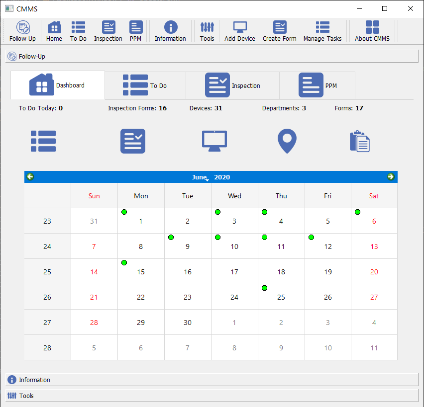
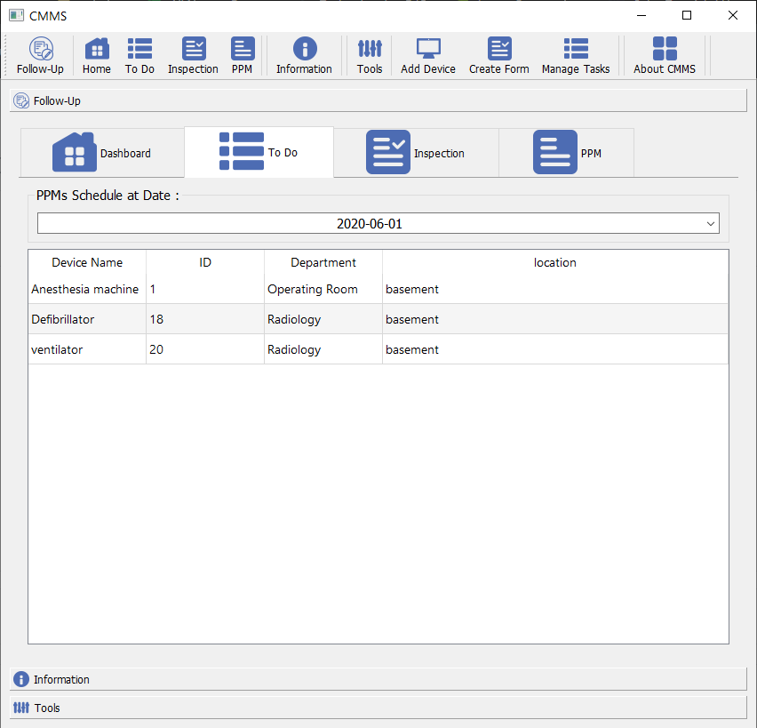
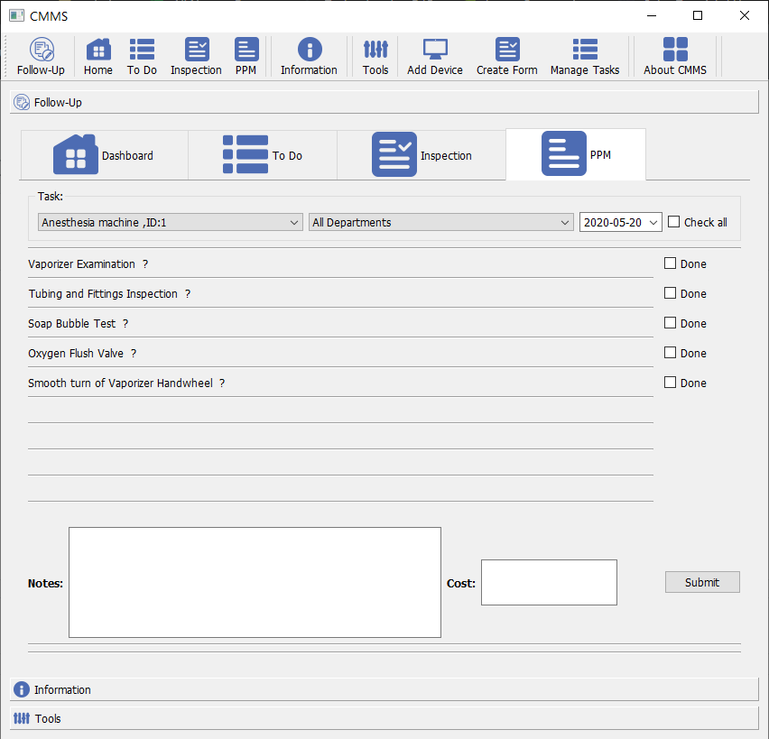
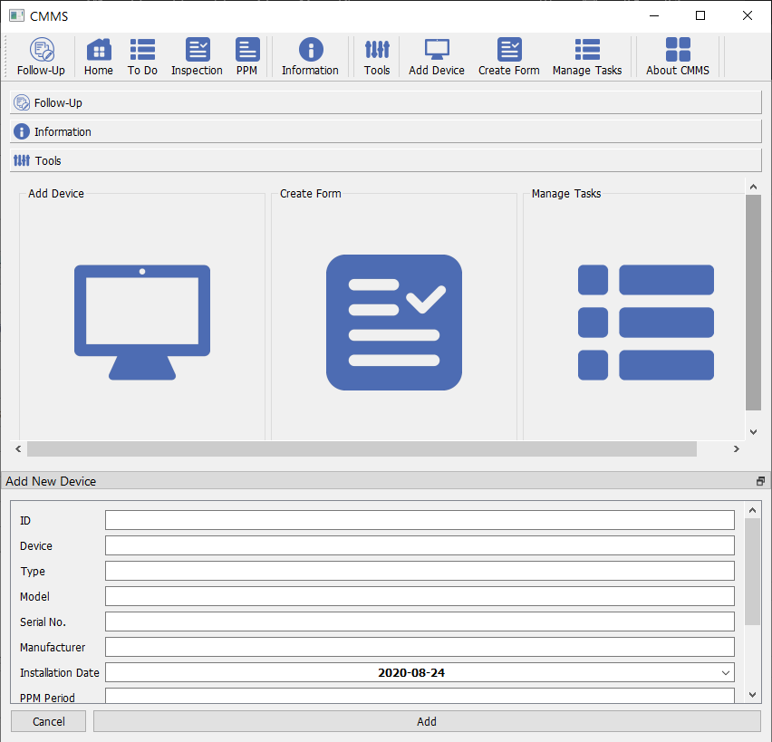

# CMMS-for-healthcare-institutions

To install required dependencies please :
* Run :
```python
 pip install -r requirements.txt
```
* Download and run :
 [ AMPPS](https://ampps.com/download)

## Description
● A software package that maintains a computer database of information about a hospital including three departments :
1.	Radiology
2.	Operating rooms (OR)
3.	Intensive care units (ICU)

## Features
● **Dahsboard:**



● **Also There is a PPM TO-DO list for any day:**


●	**Planned Preventive Maintenance (PPM) check list Form:**


● **Add Device:**



